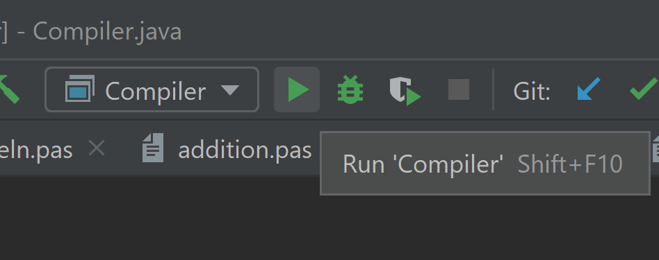

# Pascal-Compiler
Pascal Compiler made with Java for CSC 420 - Compiler Construction class  

## How to Run (on Intellij IDE)  
1. Click on edit configurations:  
  
2. Configure it to run 'Compiler.java':  

3. In Compiler.java file on line 14, change the file to a test Pascal file from the Pascal folder directory:

4. Click on Run:  

## Example Running
  
Here is a link to a video of the same gif of running the compiler:  
https://drive.google.com/file/d/1kQxm9SCWjfmDxiNEsY5lX6WOxkl8Tga9/view?usp=sharing  

## Additional notes
The Lexer and Parser portions are completed. I was not able to finish the Emitter, if I had a little more time I would probably be able to finish that.
